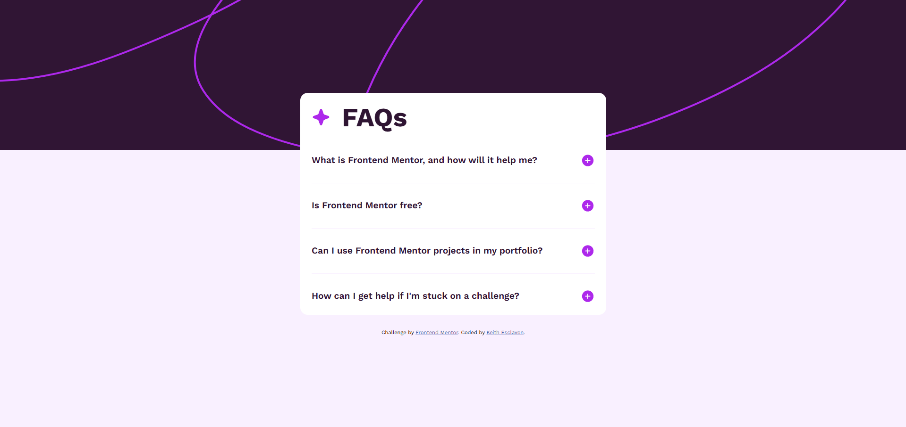

# Frontend Mentor - FAQ accordion solution

This is a solution to the [FAQ accordion challenge on Frontend Mentor](https://www.frontendmentor.io/challenges/faq-accordion-wyfFdeBwBz). Frontend Mentor challenges help you improve your coding skills by building realistic projects.

## Table of contents

- [Overview](#overview)
  - [The challenge](#the-challenge)
  - [Screenshot](#screenshot)
  - [Links](#links)
- [My process](#my-process)
  - [Built with](#built-with)
  - [What I learned](#what-i-learned)
  - [Useful resources](#useful-resources)

## Overview

### The challenge

Users should be able to:

- Hide/Show the answer to a question when the question is clicked
- Navigate the questions and hide/show answers using keyboard navigation alone
- View the optimal layout for the interface depending on their device's screen size
- See hover and focus states for all interactive elements on the page

### Screenshot

### Links

<<<<<<< HEAD

- # Solution URL: [Frontend Mentor Solution](https://www.frontendmentor.io/solutions/faq-accordion---transitioning-heights-with-css-and-js-UB-jegabOB)

- Live Site URL: https://accordion-mentor.vercel.app/

## My process

### Built with

- Semantic HTML5 markup
- CSS custom properties
- Flexbox
- Javascript
- Mobile-first workflow

### What I learned

Learned how to transition from max-height: 0; to max-height: 100%; using CSS transitions and a Javascript event listener icons.

### Useful resources

- [Transitioning to Height Auto (Two Ways)](https://keithjgrant.com/posts/2023/04/transitioning-to-height-auto/) - This helped me understand how to structuce my HTML and CSS to transition from max-height: 0; to max-height: 100%;
